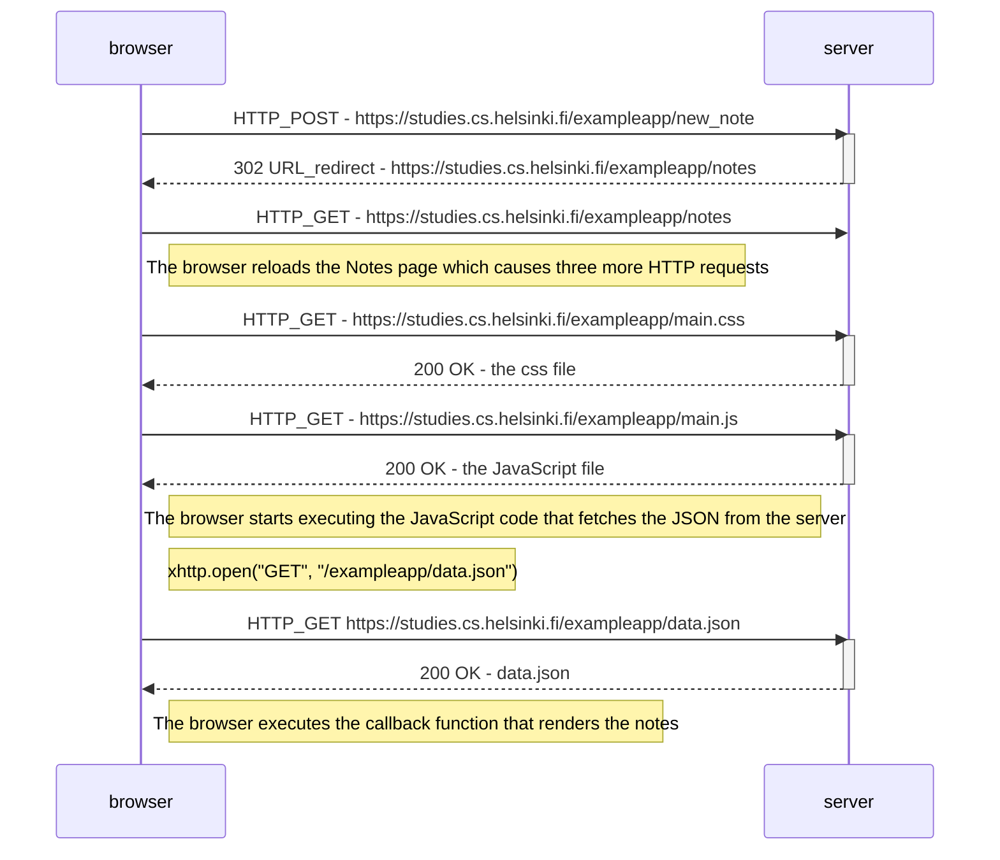

```mermaid
sequenceDiagram
    participant browser
    participant server

    browser->>server: HTTP_POST - https://studies.cs.helsinki.fi/exampleapp/new_note
    activate server
    server-->>browser: 302 URL_redirect - https://studies.cs.helsinki.fi/exampleapp/notes
    deactivate server

    browser->>server: HTTP_GET - https://studies.cs.helsinki.fi/exampleapp/notes
    Note right of browser: The browser reloads the Notes page which causes three more HTTP requests
    browser->>server: HTTP_GET - https://studies.cs.helsinki.fi/exampleapp/main.css
    activate server
    server-->>browser: 200 OK - the css file
    deactivate server

    browser->>server: HTTP_GET - https://studies.cs.helsinki.fi/exampleapp/main.js
    activate server
    server-->>browser: 200 OK - the JavaScript file
    deactivate server

    Note right of browser: The browser starts executing the JavaScript code that fetches the JSON from the server
    Note right of browser: xhttp.open("GET", "/exampleapp/data.json")

    browser->>server: HTTP_GET https://studies.cs.helsinki.fi/exampleapp/data.json
    activate server
    server-->>browser: 200 OK - data.json
    deactivate server

    Note right of browser: The browser executes the callback function that renders the notes
```
