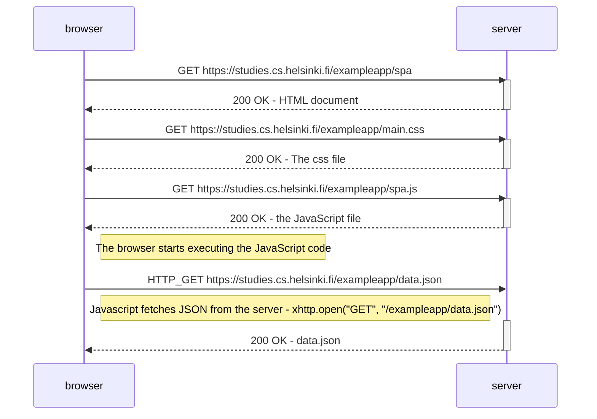

```mermaid
sequenceDiagram
    participant browser
    participant server

    browser->>server: GET https://studies.cs.helsinki.fi/exampleapp/spa
    activate server
    server-->>browser: 200 OK - HTML document
    deactivate server

    browser->>server: GET https://studies.cs.helsinki.fi/exampleapp/main.css
    activate server
    server-->>browser: 200 OK - The css file
    deactivate server

    browser->>server: GET https://studies.cs.helsinki.fi/exampleapp/spa.js
    activate server
    server-->>browser: 200 OK - the JavaScript file
    deactivate server

    Note right of browser: The browser starts executing the JavaScript code
    
    browser->>server: HTTP_GET https://studies.cs.helsinki.fi/exampleapp/data.json
    Note right of browser: Javascript fetches JSON from the server - xhttp.open("GET", "/exampleapp/data.json")
    activate server
    server-->>browser: 200 OK - data.json
    deactivate server

```
